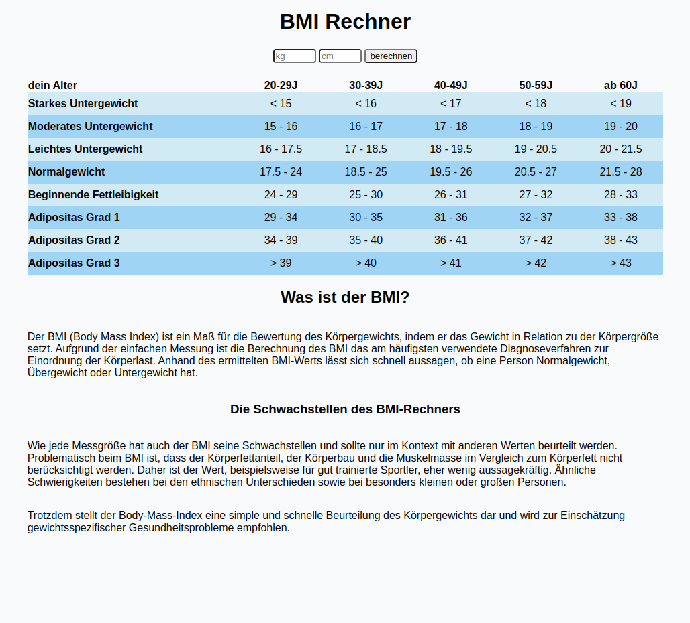
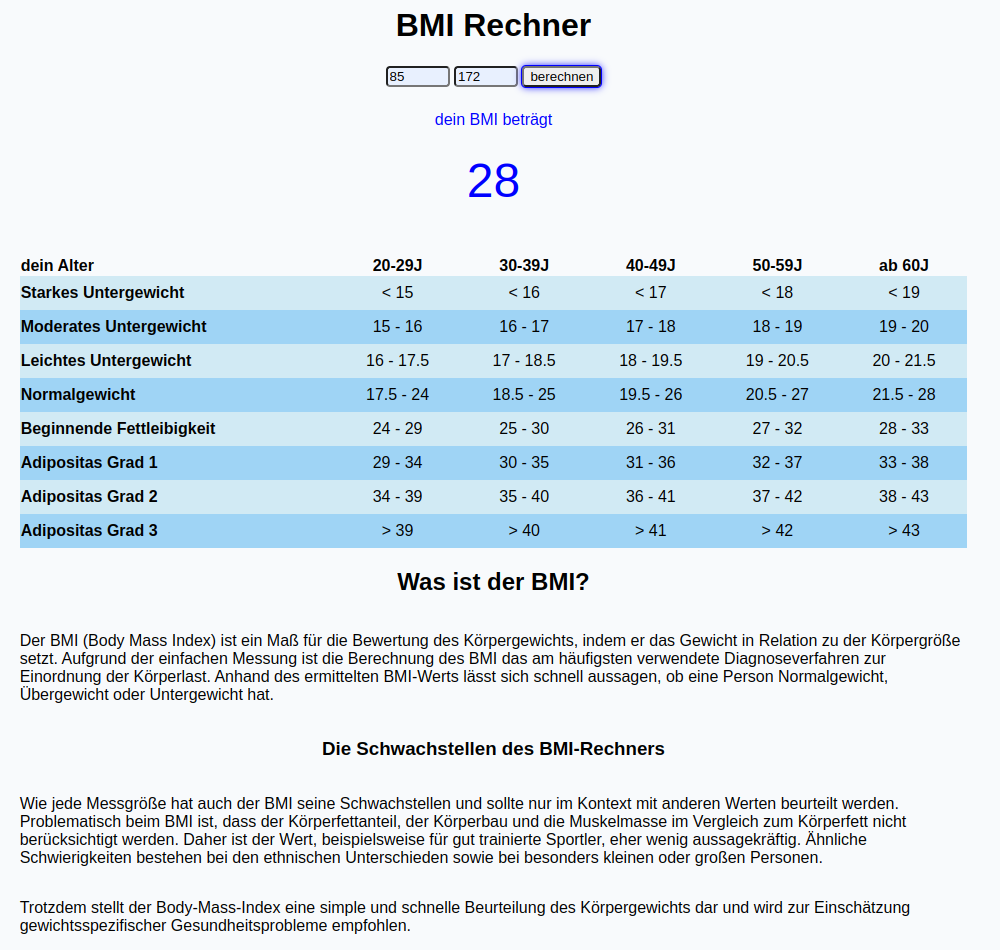

# project-BMI

**[Test this app yourself](https://holledrums.github.io/BMIrechner/)**

---

#### Navigation

- About Project

  - _Description_

- How to use this Project

  - _Description_

- Contact
  - _Mail_
  - _GitHub_
  - _LinkedIn_
- Used Tools
  - _Fonts_
  - _Design_
  - _Icons_
  - _Colors_

---

### About Project

Schreibe eine HTML Seite für einen BMI Rechner. Mit Infos, worum es sich bei einem BMI handelt und wie er sich berechnet.

Die HTML Seite hat zwei Eingabefelder für das Gewicht und die Größe und einen Button zur Berechnung.

### How to use this Project

Gib dein Gewicht in 'kg' und deine Körpergröße in 'cm' an und lass dir dein BMI berechnen, anhand der nachstehenden Tabelle kannst du sehen ob du ggf. Übergewicht hast.

##### Developed With

- [x] _HTML5_
- [x] _CSS3_
- [ ] _SASS_
- [ ] _SCSS_
- [x] _JavaScript_
- [ ] _React_
- [ ] _Bootstrap_
- [x] _npm_
- [ ] _..._

---

### Contact

Mail: <holgeraliusklose@gmail.com> 
GitHub: [Holledrums](https://github.com/holledrums) 
LinkedIn: [Holger Klose](https://www.linkedin.com/in/holger-klose-240831147/)

---

### Used Tools

- [npm](https://www.npmjs.com/)
- [Google Fonts](https://fonts.google.com/)
- [Visual Studio Code](https://code.visualstudio.com/)

---

Made with ❤️ by me
